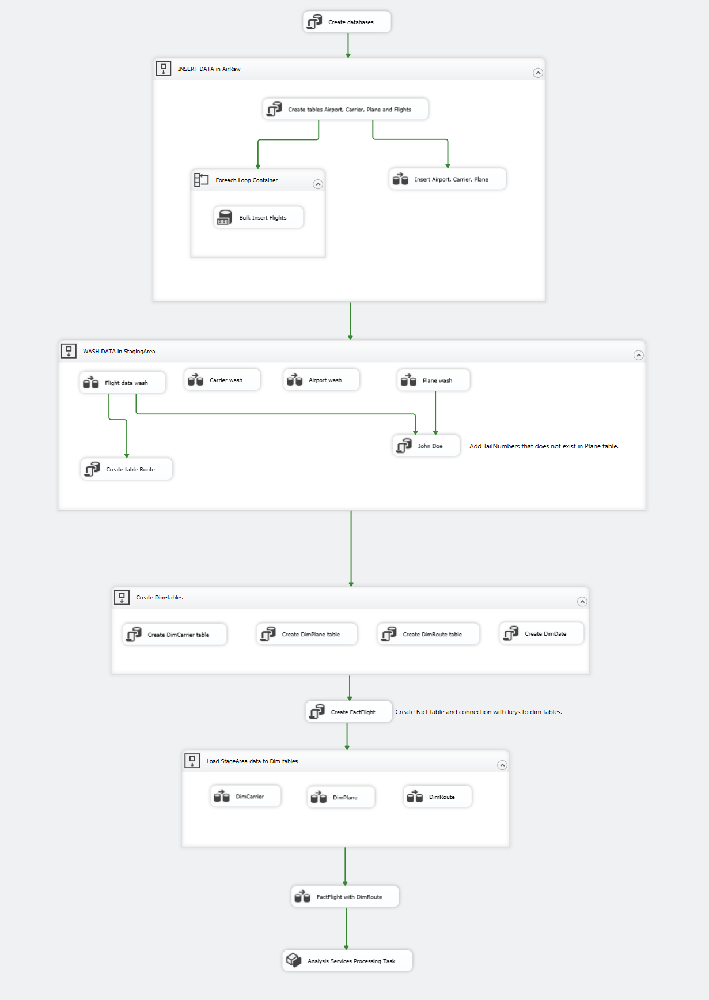
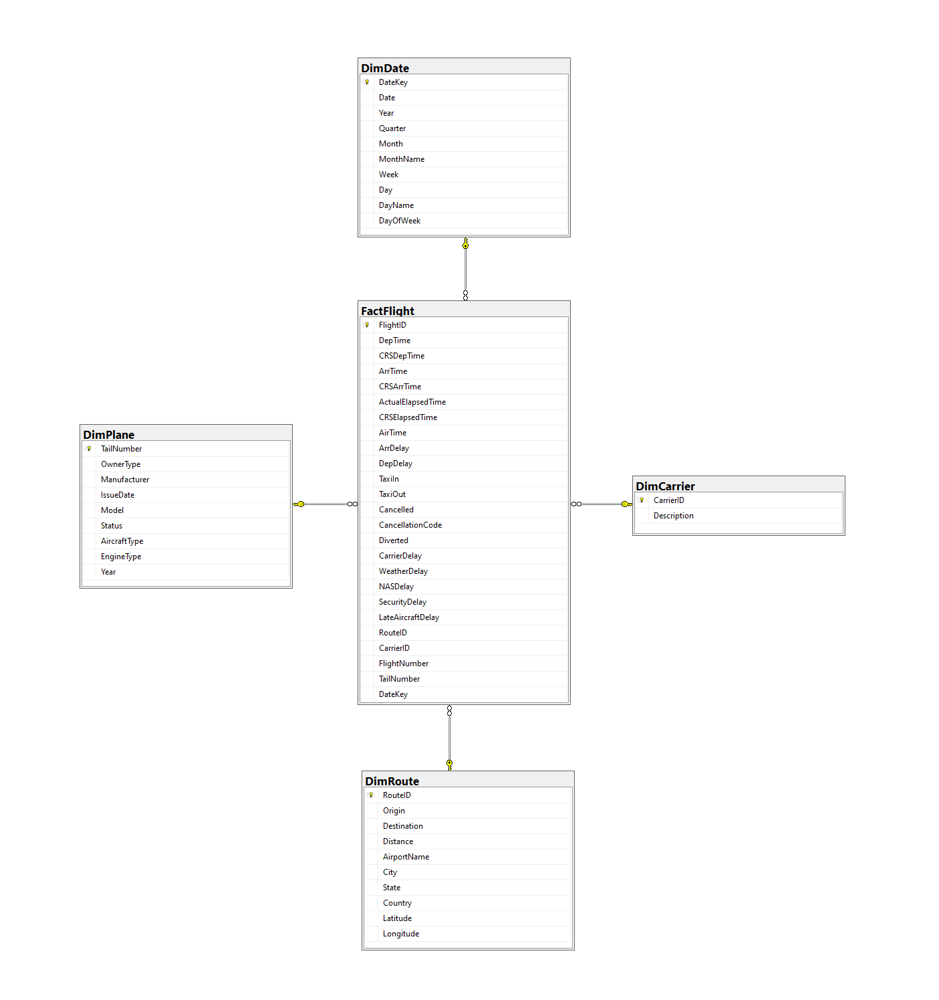
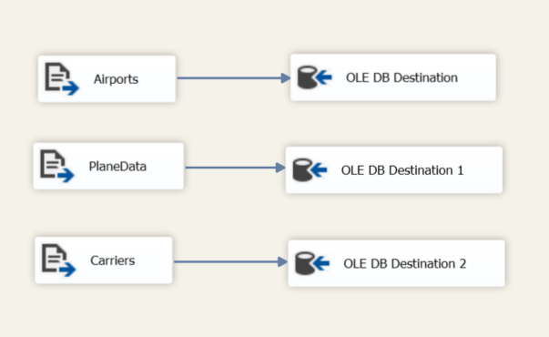
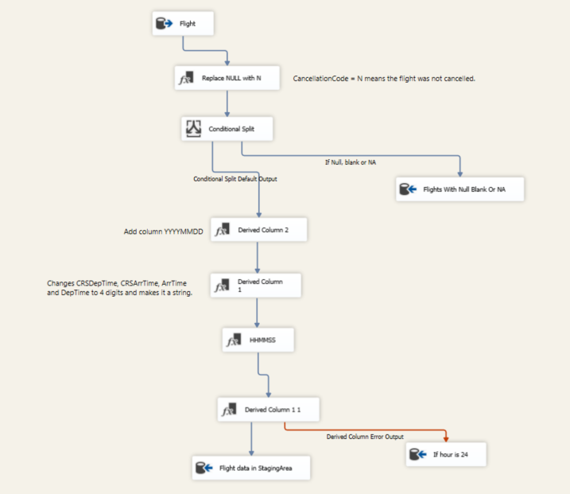
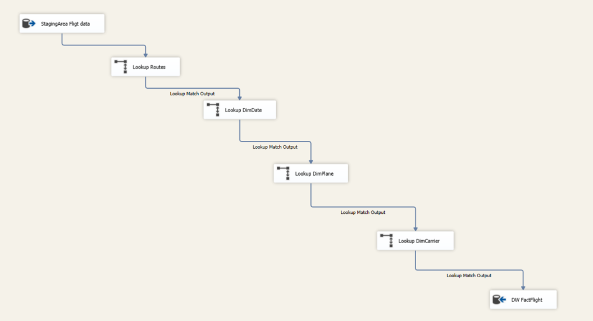
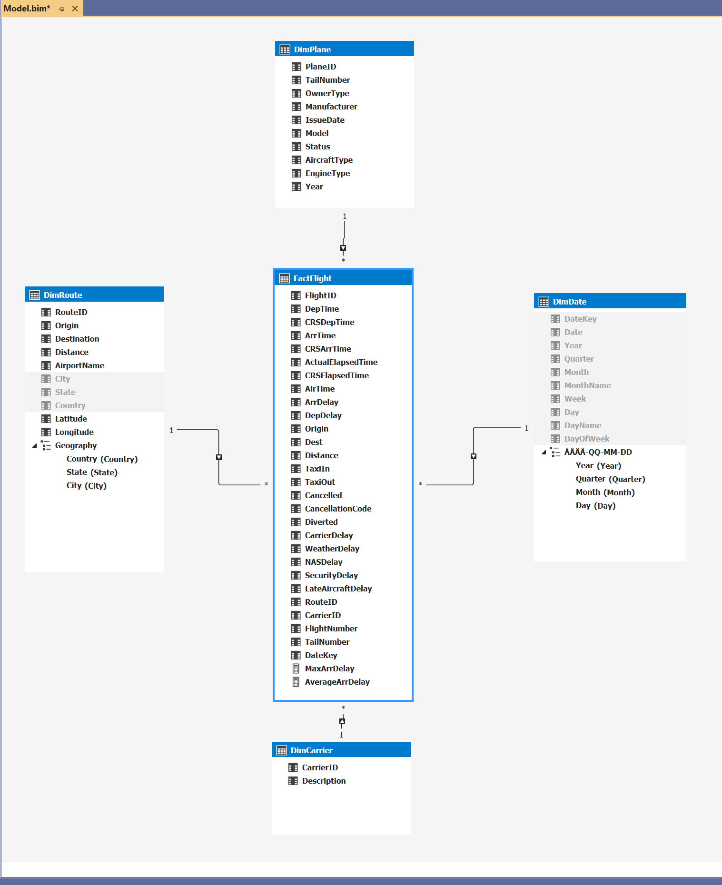

# SSIS Flight Data Analysis Project

## Project Overview

This project uses SQL Server Integration Services (SSIS) to process and analyze flight data in the USA. The project creates an ETL pipeline (Extract, Transform, Load) that takes raw data from airlines, cleanses and transforms it, and loads it into a data warehouse for analysis.

## Data Architecture

The project architecture consists of the following components:

| Component | Description |
|-----------|-------------|
| AirRaw | Raw data database containing unprocessed flight data |
| StagingArea | Intermediate database for processing and cleansing data |
| DW | Data warehouse for analysis and reporting |
| DWTabular | Tabular model for data visualization and analysis |

### Data Flow Schema

```
Raw Data (CSV files) → AirRaw → StagingArea → DW → DWTabular → Reporting
```


*Figure 1: Overall data flow in the SSIS package.*

## Data Sources

The project uses the following data sources:

| Data Source | Description | Content |
|-------------|-------------|---------|
| 2003-2008.csv | Flight data from 2003 to 2008 | Flight information such as date, departure time, arrival time, carrier, etc. |
| airports.csv | Airport information | IATA code, airport name, city, state, country, latitude and longitude |
| carriers.csv | Airline carrier information | Carrier code and carrier name |
| planes.csv | Aircraft information | Registration number, type, manufacturer, model, etc. |

## Dimension Tables

The project uses a star schema model with the following dimension tables:

1. **DimCarrier** - Airline carrier information
   * CarrierID (PK)
   * Description

2. **DimDate** - Time dimension for analysis 
   * DateKey (PK)
   * Date
   * Year
   * Quarter
   * Month
   * MonthName
   * Week
   * Day
   * DayName
   * DayOfWeek

3. **DimPlane** - Aircraft type information
   * TailNumber (PK)
   * OwnerType
   * Manufacturer
   * IssueDate
   * Model
   * Status
   * AircraftType
   * EngineType
   * Year

4. **DimRoute** - Flight route, destination, and distance information
   * RouteID (PK)
   * Origin
   * Destination
   * Distance
   * AirportName
   * City
   * State
   * Country
   * Latitude
   * Longitude

## Fact Tables

The main fact table is **FactFlight** which contains flight information linked to the dimension tables.


*Figure 2: Data model schema showing the relationship between fact tables and dimension tables.*

## ETL Process

### Extraction

Data is extracted from the following sources:

1. Flight data from CSV files (e.g., 2003.csv - 2008.csv)
2. Airport information (airports.csv)
3. Carrier information (carriers.csv)
4. Aircraft information (planes.csv)

The extraction process uses SSIS File Connection Managers and Flat File Source components to read data from CSV files.


*Figure 3: Extraction process in the SSIS package.*

### Transformations and Data Cleansing

The following transformations and data cleansing are performed during the ETL process:

#### 1. Data Type Conversions
* Converting strings to numeric values for calculations
* Converting date strings to proper date formats
* Converting time data to standard format

#### 2. Null Handling
* Missing values in departure and arrival times are replaced with default values
* NULL values in distance are replaced with 0
* Missing aircraft data is handled with an unknown aircraft reference

#### 3. Deduplication
* Removal of duplicate flight routes
* Ensuring unique carrier codes

#### 4. Lookups
* Linking flight data with route information using Origin, Destination, and Distance
* Linking flights to carrier information via carrier code
* Linking aircraft to aircraft information via TailNumber

#### 5. Filtering
* Filtering out invalid dates
* Eliminating invalid airport codes
* Removing flights with unreasonable times


*Figure 4: Example of transformations in the SSIS package.*

### Loading

Data is loaded into the data warehouse (DW) according to the following process:

1. Dimension tables are loaded first in the following order:
   * DimDate
   * DimCarrier
   * DimPlane
   * DimRoute

2. The fact table (FactFlight) is loaded and linked to dimension tables
   * Foreign keys are created against dimension tables
   * Measures are calculated (e.g., delay times, flight time)

3. The analysis model (DWTabular) is updated with the new information


*Figure 5: Loading process in the SSIS package.*

## Analysis and Visualization

### SSAS Tabular Model

The project uses a SQL Server Analysis Services (SSAS) tabular model for advanced analysis. The model consists of the following components:


*Figure 6: SSAS tabular model showing the relationships between fact and dimension tables.*

#### Fact Table (FactFlight)
Contains measures related to flights:
* FlightID
* DepTime (Departure Time)
* CRSDepTime (Scheduled Departure Time)
* ArrTime (Arrival Time)
* CRSArrTime (Scheduled Arrival Time)
* ActualElapsedTime
* CRSElapsedTime (Scheduled Elapsed Time)
* ArrDelay (Arrival Delay)
* DepDelay (Departure Delay)
* TaxiIn/TaxiOut
* Cancelled
* CancellationCode
* Diverted
* CarrierDelay
* WeatherDelay
* NASDelay (National Airspace System Delay)
* SecurityDelay
* LateAircraftDelay
* MaxArrDelay (Maximum Arrival Delay)
* AverageArrDelay (Average Arrival Delay)

#### Dimension Tables
1. **DimPlane**
   * PlaneID
   * TailNumber
   * OwnerType
   * Manufacturer
   * IssueDate
   * Model
   * Status
   * AircraftType
   * EngineType
   * Year

2. **DimRoute**
   * RouteID
   * Origin
   * Destination
   * Distance
   * AirportName
   * Geography hierarchy:
     - Country
     - State
     - City

3. **DimDate**
   * DateKey
   * Complete date hierarchy:
     - Year
     - Quarter
     - Month (MonthName)
     - Week
     - Day (DayName, DayOfWeek)

4. **DimCarrier**
   * CarrierID
   * Description

### Analysis Capabilities

With this SSAS model, users can perform the following types of analyses:

1. **Time-based Analysis**
   * Trends over time (day, week, month, quarter, year)
   * Seasonal variations in air traffic
   * Comparisons between different time periods

2. **Geographic Analysis**
   * Popular flight routes
   * Regional performance
   * Airport-specific statistics

3. **Delay Analysis**
   * Causes of delays
   * Delay patterns by carrier
   * Weather-related delays
   * Security-related delays

4. **Aircraft Analysis**
   * Performance by aircraft type
   * Age-related statistics
   * Manufacturer-specific analysis

5. **Carrier Analysis**
   * Comparison between different carriers
   * On-time performance
   * Cancelled flights and reasons

## Development Environment

This project was developed using:

- SQL Server Integration Services
- SQL Server 
- SQL Server Analysis Services (for the tabular model)
- Visual Studio with SSIS extension
